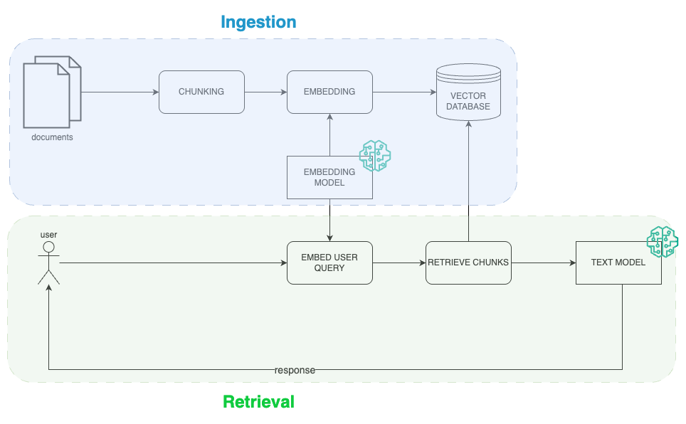

# RAG - Retrieval Agumented Generation

RAG é uma técnica que permite que você faça a LLM responder informações para as quais ela não foi treinada fornecendo um contexto adicional.

Esta técnica usa extensivamente modelos de embeddings e [vector databases](../vector_databases/) para recuperar a informação mais relevante no momento da iteração com usuário e fornecer a LLM este contexto adicional para que ela responda a pergunta.

Fluxo básico de um `RAG naive`

